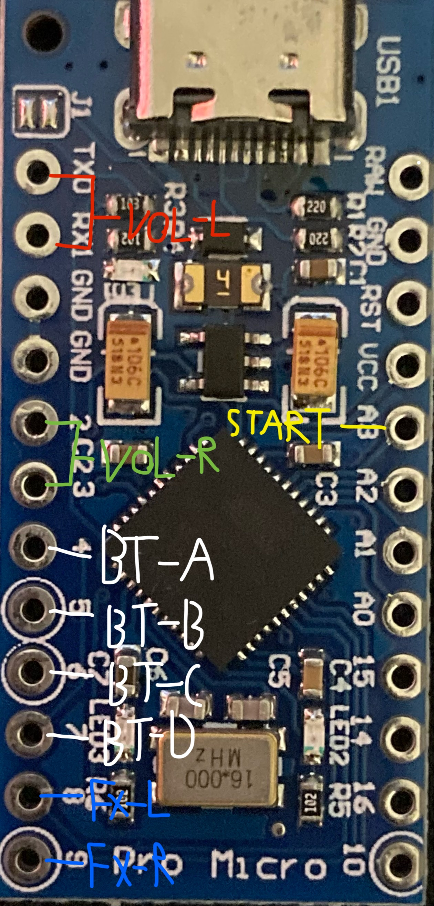

Stolen from https://github.com/speedypotato/Pocket-SDVX

## Flashing the firmware
* Open the `Janky-SDVX-Controller.ino` file in [Arduino IDE](https://www.arduino.cc/en/software)
* Go to `Tools > Board > Arduino AVR Boards` and select `Arduino Leonardo`
* Go to `Tools > Port` and select your port
* Press `Upload` (`CTRL+U`) to compile and upload the firmware to your board

## GPIO
* `4`: BT-A
* `5`: BT-B
* `6`: BT-C
* `7`: BT-D
* `8`: FX-L
* `9`: FX-R
* `21`: START
* `0` & `1`: VOL-L
* `3` & `2`: VOL-R

## Pictures (TODO)

