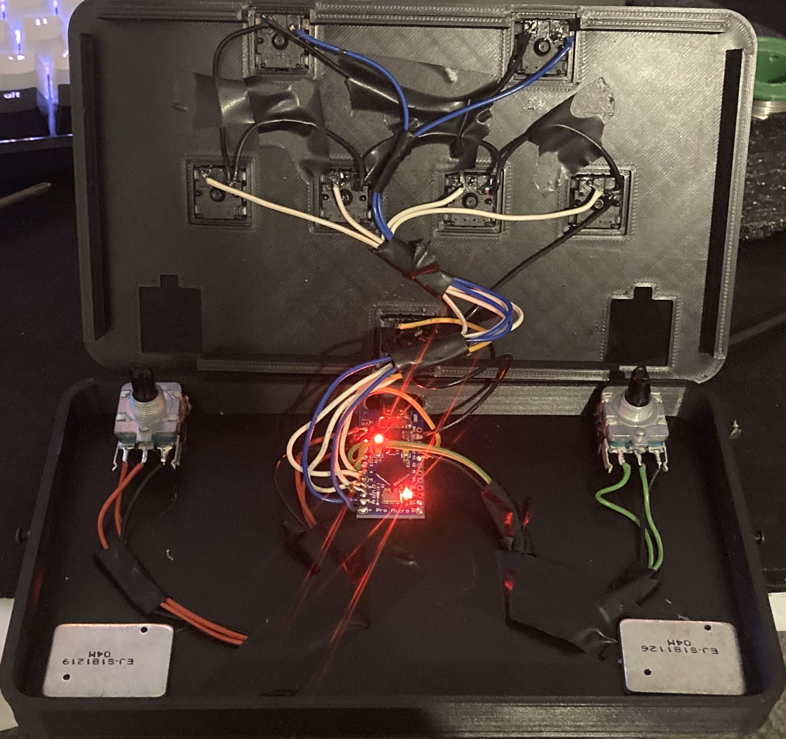

Stolen from https://github.com/speedypotato/Pocket-SDVX

## Flashing the firmware
* Open the `Janky-SDVX-Controller.ino` file in [Arduino IDE](https://www.arduino.cc/en/software)
* Go to `Tools > Board > Arduino AVR Boards` and select `Arduino Leonardo`
* Go to `Tools > Port` and select your port
* Press `Upload` (`CTRL+U`) to compile and upload the firmware to your board

## GPIO
* `2`: BT-A
* `3`: BT-B
* `4`: BT-C
* `5`: BT-D
* `6`: FX-L
* `7`: FX-R
* `21`: START
* `8` & `9`: VOL-L
* `10` & `16`: VOL-R

## Pictures (TODO)

